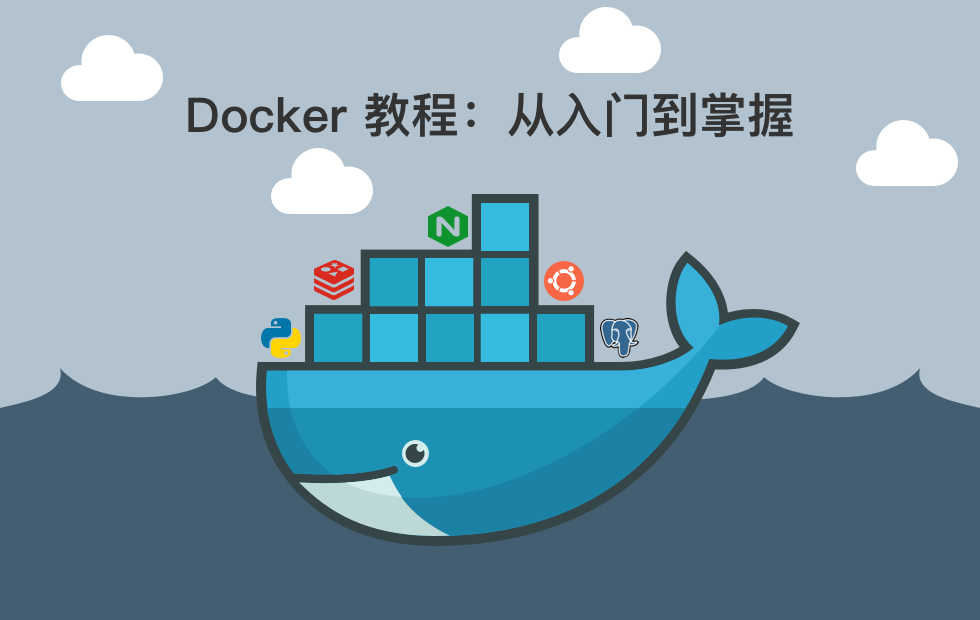

# Docker 教程：从入门到掌握

> **「Docker」 基础知识讲解和使用教程。**

通过体系化的 Docker 学习路径和动手实践项目，帮助开发者：
1. 深入理解容器化技术核心概念。
2. 掌握Docker全栈技能（从基础命令到生产环境部署）。
3. 构建可落地的容器化部署能力。

## 项目受众

- 需要容器化部署的开发者。
- 准备云原生转型的运维工程师。
- 希望提升 DevOps 能力的技术团队。

## 项目特点

- 渐进式学习：从概念了解 → 安装配置 → 镜像管理 → 容器编排
- 真实场景驱动：每个知识点配套可验证的实践任务（含示例代码）
- 排错指南：常见问题解决方案及调试技巧
- 生产级实践：网络配置、数据持久化、安全加固等企业级方案

## 章节目录

- 第 1 章  [Docker 介绍](https://github.com/datawhalechina/docker-notes/tree/main/docs/ch1/ch1.md)
    - [1.1 Docker 的特点与架构](https://github.com/datawhalechina/docker-notes/tree/main/docs/ch1/ch1_1.md)
    - [1.2 Docker 核心概念](https://github.com/datawhalechina/docker-notes/tree/main/docs/ch1/ch1_2.md)
    - [1.3 Docker 和虚拟机对比](https://github.com/datawhalechina/docker-notes/tree/main/docs/ch1/ch1_3.md)
- 第 2 章  [Docker 安装](https://github.com/datawhalechina/docker-notes/tree/main/docs/ch2/ch2.md)
    - [2.1 CentOS Docker 安装](https://github.com/datawhalechina/docker-notes/tree/main/docs/ch2/ch2_1.md)
    - [2.2 macOS Docker 安装](https://github.com/datawhalechina/docker-notes/tree/main/docs/ch2/ch2_2.md)
    - [2.3 Windows Docker 安装](https://github.com/datawhalechina/docker-notes/tree/main/docs/ch2/ch2_3.md)
- 第 3 章  [Docker 使用](https://github.com/datawhalechina/docker-notes/tree/main/docs/ch3/ch3.md)
    - [3.1 配置镜像源地址](https://github.com/datawhalechina/docker-notes/tree/main/docs/ch3/ch3_1.md)
    - [3.2 Docker 服务使用](https://github.com/datawhalechina/docker-notes/tree/main/docs/ch3/ch3_2.md)
    - [3.3 Docker 镜像使用](https://github.com/datawhalechina/docker-notes/tree/main/docs/ch3/ch3_3.md)
    - [3.4 Docker 容器使用](https://github.com/datawhalechina/docker-notes/tree/main/docs/ch3/ch3_4.md)
    - [3.5 私有镜像仓库](https://github.com/datawhalechina/docker-notes/tree/main/docs/ch3/ch3_5.md)
- 第 4 章  [Docker Dockerfile](https://github.com/datawhalechina/docker-notes/tree/main/docs/ch4/ch4.md)
    - [4.1 Dockerfile 简单使用](https://github.com/datawhalechina/docker-notes/tree/main/docs/ch4/ch4_1.md)
    - [4.2 Dockerfile 常用指令](https://github.com/datawhalechina/docker-notes/tree/main/docs/ch4/ch4_2.md)
    - [4.3 Dockerfile 实际使用](https://github.com/datawhalechina/docker-notes/tree/main/docs/ch4/ch4_3.md)
- 第 5 章  [Docker Compose](https://github.com/datawhalechina/docker-notes/tree/main/docs/ch5/ch5.md)
    - [5.1 Docker Compose 安装](https://github.com/datawhalechina/docker-notes/tree/main/docs/ch5/ch5_1.md)
    - [5.2 Docker Compose 文件结构](https://github.com/datawhalechina/docker-notes/tree/main/docs/ch5/ch5_2.md)
    - [2.3 Docker Compose 常用操作命令](https://github.com/datawhalechina/docker-notes/tree/main/docs/ch5/ch5_3.md)
- 第 6 章  [Docker 常用命令](https://github.com/datawhalechina/docker-notes/tree/main/docs/ch6/ch6.md)
    - [6.1 Docker 服务命令](https://github.com/datawhalechina/docker-notes/tree/main/docs/ch6/ch6_1.md)
    - [6.2 Docker 镜像命令](https://github.com/datawhalechina/docker-notes/tree/main/docs/ch6/ch6_2.md)
    - [6.3 Docker 容器命令](https://github.com/datawhalechina/docker-notes/tree/main/docs/ch6/ch6_3.md)
- [参考资料](https://github.com/datawhalechina/docker-notes/tree/main/docs/others/reference.md)
