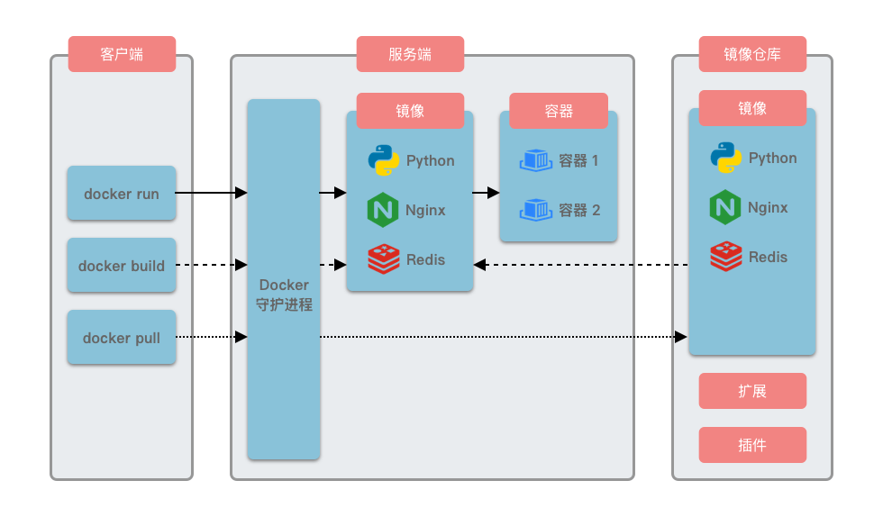

## 1.1 Docker 的特点与架构

Docker 有几个显著特点：

1. **轻量性**：由于容器共享宿主机的操作系统内核，它们比传统虚拟机更小且启动更快，解决了传统虚拟化技术资源占用高、启动慢的问题。
2. **可移植性**：Docker 容器可以在任何支持 Docker 的平台上运行，无论是本地开发机、物理服务器还是云环境，彻底解决了「在我机器上能跑，线上却不行」的难题。
3. **隔离性**：每个容器拥有独立的文件系统、网络和进程空间，确保应用之间互不干扰，避免了传统部署中多个应用共用环境导致的依赖冲突问题。
4. **标准化**：Docker 提供统一的接口和工具链，使得构建、分发和运行容器变得简单高效，替代了传统部署中复杂的手动配置流程。

Docker 采用了客户端-服务器架构。Docker 客户端负责发送命令，Docker 守护进程（服务端）负责执行这些命令。它们可以运行在同一台机器上，也可以分开运行。客户端和守护进程通过 UNIX 套接字或网络接口进行通信，使用 REST API 交换数据。这种架构让用户可以通过本地或远程客户端管理 Docker 服务。Docker 的架构图如下所示：

