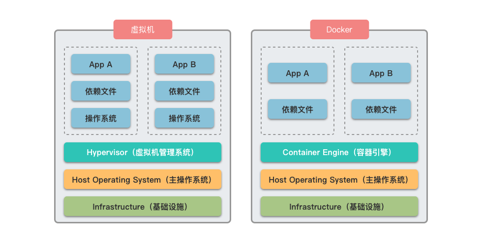

## 1.3 Docker 和虚拟机对比

Docker 和虚拟机都是用来隔离应用运行环境的技术，但它们的工作原理和资源占用方式完全不同。Docker 容器不需要模拟整个操作系统，而是直接运行在宿主机的内核上，这使得容器启动更快、占用资源更少，同时仍能提供良好的隔离性。

Docker 容器和虚拟机的具体区别如下：

- **Docker 容器**：使用 Docker 引擎进行调度和隔离，直接共享宿主机的操作系统内核，不需要额外的操作系统层，这使得容器启动更快、占用资源更少。
- **虚拟机**：通过 Hypervisor 软件模拟完整的硬件环境，管理每个虚拟机中操作系统的运行。每个虚拟机需要运行独立的操作系统、应用程序和必要的依赖文件等，因此启动速度慢且占用大量内存和存储。

虚拟机的隔离性更强，因为每个虚拟机有完全独立的操作系统，适合运行需要强隔离的不同类型应用。Docker 的隔离性主要依靠 Linux 内核的命名空间和控制组功能，虽然隔离程度不如虚拟机，但对于大多数应用场景已经足够。Docker 和虚拟机对比如图所示：

