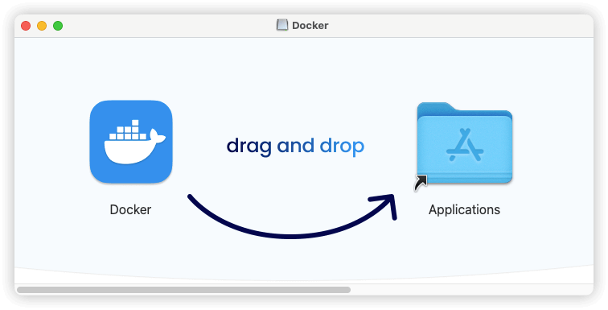

## 2.2 macOS Docker 安装

在 macOS 系统上安装 Docker 需要下载并安装「[Docker Desktop for Mac](https://docs.docker.com/docker-for-mac/)」 应用程序。Docker Desktop 是官方提供的图形化工具，它包含了 Docker 引擎、命令行工具和图形界面，让用户能够方便地在 macOS 上使用 Docker。

目前 macOS 上安装 Docker Desktop 有两种方法：「使用 Homebrew 安装」和「手动下载安装」。

#### 2.2.1 使用 Homebrew 安装

第一种方法是使用 Homebrew 工具安装，打开终端并运行命令 `brew install --cask docker`，这个命令会自动下载并安装最新版的 Docker Desktop。

```shell
$ brew install --cask docker
==> Downloading https://formulae.brew.sh/api/cask_tap_migrations.jws.json
==> Downloading https://formulae.brew.sh/api/formula_tap_migrations.jws.json
==> Downloading https://raw.githubusercontent.com/Homebrew/homebrew-cask/b946820
######################################################################### 100.0%
==> Downloading https://desktop.docker.com/mac/main/arm64/187762/Docker.dmg
######################################################################### 100.0%
==> Installing Cask docker
==> Moving App 'Docker.app' to '/Applications/Docker.app'
==> Linking Binary 'docker-compose.zsh-completion' to '/opt/homebrew/share/zsh/s
==> Linking Binary 'docker-compose.fish-completion' to '/opt/homebrew/share/fish
==> Linking Binary 'compose-bridge' to '/usr/local/bin/compose-bridge'
==> Linking Binary 'docker' to '/usr/local/bin/docker'
==> Linking Binary 'docker-credential-desktop' to '/usr/local/bin/docker-credent
==> Linking Binary 'docker-credential-ecr-login' to '/usr/local/bin/docker-crede
==> Linking Binary 'docker-credential-osxkeychain' to '/usr/local/bin/docker-cre
==> Linking Binary 'kubectl' to '/usr/local/bin/kubectl.docker'
==> Linking Binary 'docker-compose' to '/usr/local/cli-plugins/docker-compose'
Password: # 如果需要输入密码，则输入电脑密码
==> Linking Binary 'docker.bash-completion' to '/opt/homebrew/etc/bash_completio
==> Linking Binary 'docker.zsh-completion' to '/opt/homebrew/share/zsh/site-func
==> Linking Binary 'docker.fish-completion' to '/opt/homebrew/share/fish/vendor_
==> Linking Binary 'hub-tool' to '/usr/local/bin/hub-tool'
==> Linking Binary 'docker-compose.bash-completion' to '/opt/homebrew/etc/bash_c
🍺  docker was successfully installed!
```

#### 2.2.2 手动下载安装

第二种方法是手动下载安装包。具体步骤如下：

1. 访问 Docker 官网的 [下载页面](https://docs.docker.com/desktop/setup/install/mac-install/)，选择与你的 Mac 芯片类型匹配的版本下载。
2. 下载完成后双击 .dmg 文件，将 Docker 图标拖到 Applications 文件夹中完成安装。
3. 安装完成后，在应用程序文件夹中找到 Docker 并双击启动，首次启动时会提示你授予权限，需要输入系统密码确认。
4. 启动 Docker Desktop 后，你会在屏幕顶部菜单栏看到 Docker 的鲸鱼图标，这表示 Docker 正在运行。
5. 打开终端输入 `docker --version` 可以检查 Docker 是否安装成功，如果显示版本号说明安装正确。



Docker Desktop 默认会在开机时自动启动，你也可以在设置中调整这个选项。安装完成后，你可以直接使用 docker 命令在终端中操作容器，或者通过 Docker Desktop 的图形界面管理容器和镜像。需要注意的是，由于 macOS 的特殊性，Docker 在文件共享和网络配置方面与 Linux 系统有些差异，具体使用时可能需要调整相关设置。