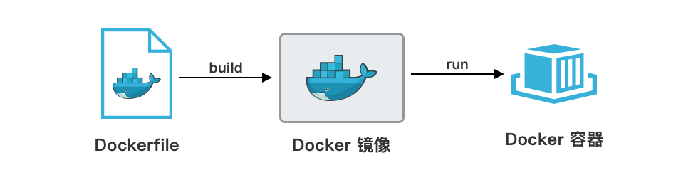

# 第 4 章  Docker Dockerfile

> **Dockerfile**：Dockerfile 是用来构建 Docker 镜像的文本文件，它包含了一系列的指令和配置，用于告诉 Docker 如何构建一个镜像。

使用 Dockerfile 可以自动构建镜像，这样在不同的电脑上都能得到一样的镜像。Dockerfile 里可以写很多不同的指令，比如指定用什么基础镜像、往镜像里放什么文件、安装什么软件、设置什么环境变量、打开什么端口、运行什么命令等。每一条指令都会在镜像里新建一层，所有层叠在一起就是最终的镜像。这种分层的方式让镜像构建更快，也更容易分享和重复使用。

在实际开发中，虽然官方镜像提供了基础运行环境，但项目通常需要特定的配置、依赖、文件、程序代码，这时我们就需要用 Dockerfile 来定制自己的镜像。